# Dependency Graph

This page shows the module-level dependencies between EstaCoda's source directories.

## Visualization

```mermaid
graph TD
    subgraph Contracts["src/contracts/ — Type Hub (1,777 lines)"]
        TOOL["tool.ts<br/>44 imports"]
        PROV["provider.ts<br/>23 imports"]
        SKILL["skill.ts<br/>18 imports"]
        SEC["security.ts<br/>16 imports"]
        CHAN["channel.ts<br/>16 imports"]
        SESS["session.ts<br/>14 imports"]
        MEM["memory.ts<br/>11 imports"]
        RTEV["runtime-event.ts<br/>9 imports"]
        ART["artifact.ts<br/>8 imports"]
        INTENT["intent.ts<br/>7 imports"]
        TPLAN["tool-plan.ts<br/>3 imports"]
        PROMPT["prompt.ts<br/>3 imports"]
    end

    subgraph Runtime["src/runtime/ — Orchestration (4,090 lines)"]
        AL["agent-loop.ts<br/>2,714 lines — MONOLITH"]
        CRT["create-runtime.ts<br/>830 lines — FACTORY"]
        IR["intent-router.ts<br/>546 lines"]
    end

    subgraph Skills["src/skills/ — Skill System (5,606 lines)"]
        SLOADER["skill-loader.ts<br/>916 lines"]
        SREG["skill-registry.ts<br/>199 lines"]
        STOOLS["skill-tools.ts<br/>2,292 lines"]
        SEVO["skill-evolution.ts<br/>665 lines"]
        SLEARN["skill-learning.ts<br/>497 lines"]
        SSYNC["skill-bundled-sync.ts<br/>417 lines"]
        SMUT["skill-mutation-policy.ts<br/>83 lines"]
        SWPLAN["skill-workflow-planner.ts<br/>148 lines"]
        STELEM["skill-usage-telemetry.ts<br/>41 lines"]
    end

    subgraph Tools["src/tools/ — Tool System (4,510 lines)"]
        TEXEC["tool-executor.ts<br/>462 lines"]
        TPLANNER["tool-call-planner.ts<br/>132 lines"]
        TREG["tool-registry.ts<br/>76 lines"]
        TBUILT["builtin-tools.ts<br/>68 lines"]
        TWEB["web-tools.ts<br/>731 lines"]
        TWS["workspace-tools.ts<br/>577 lines"]
        TCODE["execute-code-tool.ts<br/>~300 lines"]
        TIMG["image-generation-tools.ts<br/>~300 lines"]
    end

    subgraph Providers["src/providers/ — Provider Layer (2,206 lines)"]
        PEXEC["provider-executor.ts<br/>465 lines"]
        PROUT["provider-router.ts<br/>83 lines"]
        AUXP["auxiliary-provider-router.ts<br/>184 lines"]
        OPEAI["openai-compatible-provider.ts<br/>838 lines"]
        PREG["provider-registry.ts<br/>41 lines"]
    end

    subgraph Memory["src/memory/ — Memory Layer (1,074 lines)"]
        MSTORE["memory-store.ts<br/>141 lines"]
        MRENDER["memory-renderer.ts<br/>60 lines"]
        MPROMO["memory-promotion.ts<br/>326 lines"]
        MLOCAL["local-memory-provider.ts<br/>187 lines"]
        MTOOL["memory-tool.ts<br/>82 lines"]
    end

    subgraph Security["src/security/ — Security Layer (1,185 lines)"]
        SPF["security-policy-factory.ts<br/>422 lines"]
        CSAF["command-safety.ts<br/>172 lines"]
        WAPC["workspace-approval-controller.ts<br/>350 lines"]
        WTRUST["workspace-trust-store.ts<br/>139 lines"]
    end

    subgraph Channels["src/channels/ — Channel Layer (3,607 lines)"]
        CGATE["channel-gateway.ts<br/>1,408 lines"]
        GWRUN["gateway-runner.ts<br/>463 lines"]
        TELA["telegram-adapter.ts<br/>847 lines"]
        CSSTORE["channel-session-store.ts<br/>294 lines"]
        CASTORE["channel-approval-store.ts<br/>156 lines"]
    end

    subgraph Prompt["src/prompt/ — Prompt Layer (1,145 lines)"]
        PASSEM["prompt-assembly.ts<br/>964 lines"]
        HPACK["history-packer.ts<br/>134 lines"]
        PCACHE["prompt-cache.ts<br/>47 lines"]
    end

    subgraph Session["src/session/ — Session Layer (502 lines)"]
        IMSESS["in-memory-session-db.ts<br/>157 lines"]
        SQLSESS["sqlite-session-db.ts<br/>345 lines"]
    end

    subgraph Trajectory["src/trajectory/ — Trajectory (97 lines)"]
        TREC["trajectory-recorder.ts<br/>97 lines — THIN"]
    end

    subgraph Artifacts["src/artifacts/ — Artifacts (56 lines)"]
        ASTORE["artifact-store.ts<br/>56 lines — THIN"]
    end

    subgraph CLI["src/cli/ — CLI (4,106 lines)"]
        CLIMAIN["cli.ts<br/>2,562 lines"]
        SLOOP["session-loop.ts<br/>906 lines"]
    end

    subgraph Smoke["src/smoke.ts — Tests (13,969 lines)"]
        SMOKE["smoke.ts<br/>89 imports — MONOLITH"]
    end

    %% Central orchestration flows
    CRT --> AL
    CRT --> IR
    CRT --> SLOADER
    CRT --> SREG
    CRT --> STOOLS
    CRT --> TEXEC
    CRT --> TREG
    CRT --> PEXEC
    CRT --> MSTORE
    CRT --> MLOCAL
    CRT --> SPF
    CRT --> WTRUST
    CRT --> CGATE
    CRT --> TREC
    CRT --> ASTORE

    AL --> IR
    AL --> TEXEC
    AL --> TPLANNER
    AL --> PEXEC
    AL --> MLOCAL
    AL --> STOOLS
    AL --> SEVO
    AL --> SLEARN
    AL --> TREC
    AL --> PASSEM
    AL --> HPACK
    AL --> SEC
    AL --> SPF
    AL --> WAPC

    IR --> SKILL
    IR --> INTENT
    IR --> TOOL

    TEXEC --> TREG
    TEXEC --> TBUILT
    TEXEC --> TWEB
    TEXEC --> TWS
    TEXEC --> TCODE
    TEXEC --> CSAF

    PEXEC --> PROV
    PEXEC --> OPEAI
    PEXEC --> AUXP

    STOOLS --> SKILL
    STOOLS --> TOOL
    STOOLS --> SREG
    STOOLS --> SLOADER

    MLOCAL --> MSTORE
    MLOCAL --> MPROMO
    MLOCAL --> MRENDER

    CGATE --> TELA
    CGATE --> CSSTORE
    CGATE --> CASTORE
    CGATE --> CHAN
    CSSTORE --> CGATE

    PASSEM --> PROV
    PASSEM --> SESS
    PASSEM --> MEM
    PASSEM --> PCACHE

    SMOKE --> AL
    SMOKE --> CRT
    SMOKE --> IR
    SMOKE --> TOOL
    SMOKE --> SKILL
    SMOKE --> PROV
    SMOKE --> MEM
    SMOKE --> SEC

    style AL fill:#ff9999
    style CRT fill:#ffcccc
    style SMOKE fill:#ffcccc
    style TREC fill:#ffeb99
    style ASTORE fill:#ffeb99
    style TOOL fill:#99ccff
    style PROV fill:#99ccff
    style SKILL fill:#99ccff
```

## Key Observations

- **Contract layer is the foundation.** `src/contracts/` is imported by almost every other module. It contains pure types with no runtime logic.
- **Skill system is the largest leaf.** `src/skills/` has many internal dependencies but few external consumers outside the runtime.
- **Runtime is the integration hub.** `src/runtime/` imports from skills, tools, providers, memory, channels, and security.
- **CLI and channels are sibling consumers.** Both depend on the runtime but not on each other.
- **Circular dependencies are minimal.** Only 3 bidirectional pairs detected:
  - `config/runtime-config.ts` ↔ `contracts/image-generation.ts`
  - `contracts/intent.ts` ↔ `contracts/skill.ts`
  - `channels/channel-gateway.ts` ↔ `channels/channel-session-store.ts`

## Hotspots (Most-Imported Files)

| File | Import Count | Role |
|------|-------------|------|
| `contracts/tool.ts` | 44 | Tool definitions and risk classes |
| `contracts/skill.ts` | 38 | Skill definitions and workflow types |
| `contracts/provider.ts` | 30 | Provider request/response types |
| `contracts/security.ts` | 26 | Security policy and decision types |
| `config/runtime-config.ts` | 24 | Runtime configuration types |

## Generated

This graph was generated from static analysis of all `src/**/*.ts` files on 2026-05-02.
